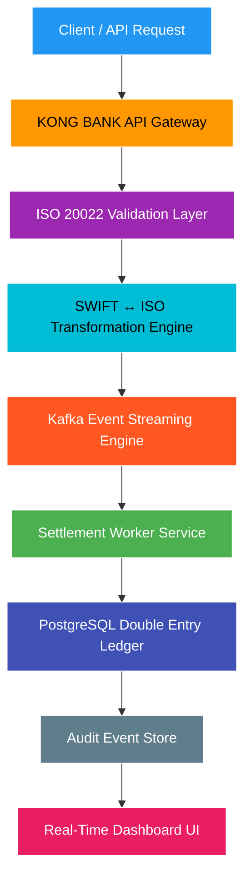
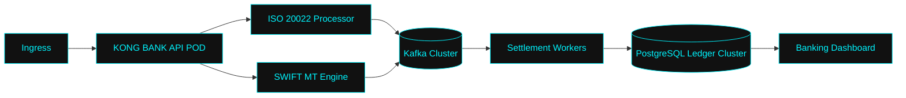
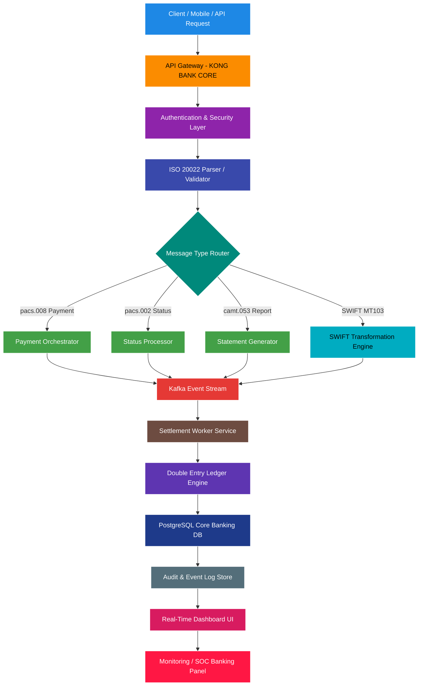

# 🏦 KONG BANK — CORE BANKING CLOUD SYSTEM

---

## 🧠 SYSTEM DESCRIPTION

| 🏦 Core Banking Ledger | 📡 ISO 20022 Messaging | 🔁 SWIFT Bridge | ⚙️ Event Engine | ☸️ Cloud Platform | 📊 Monitoring |
|------------------------|------------------------|------------------|------------------|------------------|----------------|
| Double-entry accounting system | pacs.008 / camt / pacs.002 support | MT103 compatibility layer | Kafka event-driven settlement | Kubernetes-native architecture | Real-time banking dashboard |
| ACID-compliant ledger system | Cross-bank messaging standard | ISO ↔ SWIFT transformation | Async transaction processing | Microservices deployment model | Live transaction tracking |
| Balance integrity guarantee | Financial interoperability layer | Legacy SWIFT integration | High-throughput pipeline | Scalable cloud infrastructure | Audit & reporting system |

## 🏗️ SYSTEM ARCHITECTURE (MERMAID)

## ☸️ KUBERNETES ARCHITECTURE

---

## DATA FLOW

## 🧾 CORE FEATURES

| 🏦 Core Banking Engine | 📡 Messaging Layer | ⚙️ Event-Driven Architecture | ☸️ Cloud-Native Deployment |
|------------------------|--------------------|------------------------------|-----------------------------|
| Double-entry accounting system | ISO 20022 messaging support (pacs.008, camt.053, pacs.002) | Kafka-based streaming settlement engine | Kubernetes-ready microservices architecture |
| Real-time balance updates | SWIFT MT103 transformation layer | Asynchronous transaction processing | Horizontal auto-scaling support |
| ACID-compliant transaction consistency | Cross-network interoperability bridge | High-throughput payment pipeline | Distributed banking system design |

## ☕ Support the Project

If this project has helped your research, learning, or security operations, consider supporting its continued development.

